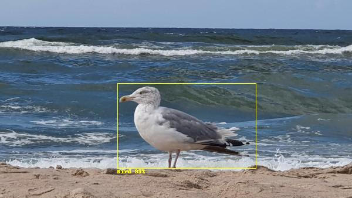
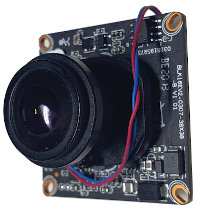
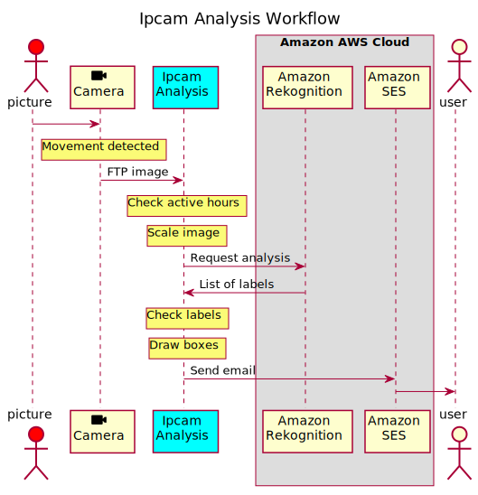
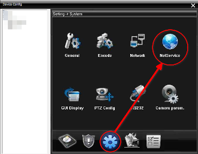
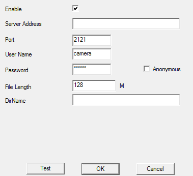
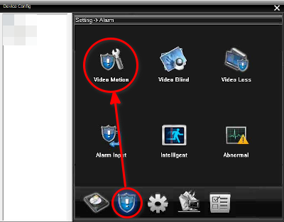
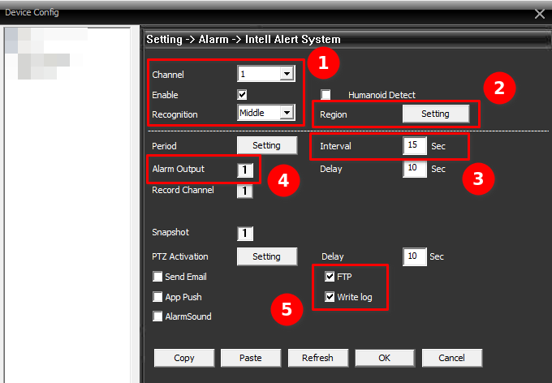
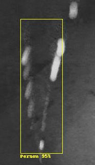

<pre>
  ___                                _                _           _     
 |_ _|_ __   ___ __ _ _ __ ___      / \   _ __   __ _| |_   _ ___(_)___ 
  | || '_ \ / __/ _` | '_ ` _ \    / _ \ | '_ \ / _` | | | | / __| / __|
  | || |_) | (_| (_| | | | | | |  / ___ \| | | | (_| | | |_| \__ \ \__ \
 |___| .__/ \___\__,_|_| |_| |_| /_/   \_\_| |_|\__,_|_|\__, |___/_|___/
     |_|                                                |___/           
</pre>
# Introduction
This project integrates popular cheap network cameras with an image analysis service. It notifies users by email when defined objects are recognized.

The solution automatically process images from cameras making it good for surveillance, animals watching, and so on.



## Features

* **Works with any camera that supports FTP image upload**
* **Requires no processor power**
* **Minimizes camera false alarms**
* **Works on small ARM boards like Raspberry Pi**
* **Makes use of Amazon AWS cloud services**
* **Supports multiple cameras**
* **Function to automatically test Amazon AWS credentials**
* **Source code in Python makes it ideal for modifications**
* **Works as standalone program or systemd service**

## Applications

* **Surveillance**
* **Animal watching**
* **Home automation**

### License

This program is free software: you can redistribute it and/or modify
it under the terms of the GNU General Public License as published by
the Free Software Foundation, either version 3 of the License, or
(at your option) any later version.

## Requirements

* Linux based machine (should work on Windows but never tested)
* Installed Python >= 3.8
* Network camera that supports FTP transfer and movement detection. All Hisilicon based cameras support these functions. That means every cheap Chinese camera can be used.
  <br>
* Amazon AWS account (trial version is ok)

## Theory of operation

HISILICON based camera supports movement detection. If detected, the camera can send the image to a specified FTP server.
The program works as an FTP server when an image is received it is transferred to Amazon Rekognition 
service to detect an object. 
FTP protocol was selected as this is the only way to get a clear frame. Alternative method of
processing video stream is slower and gives low quality images (depending on bitrate).

If the object list contains any of the predefined objects, an email is sent to specified recipients.
The image is attached to the list of detected objects.
If an error occurs, an email is also sent. All operations are logged in a file or console.



# Configuration

Three steps must be performed before running the program.

1. Create Amazon AWS account and grant permissions for SES and Rekognition.
1. Install and configure Ipcam Analysis .
1. Setup camera to generate an alarm for movement and uploads image to FTP server.


## Amazon AWS

Create [Amazon AWS](https://aws.amazon.com/premiumsupport/knowledge-center/create-and-activate-aws-account/account) account if you do not have one.
They got some free stuff for the first year.

1. Go to IAM and create a new user.
1. Grant permissions by clicking **Attach existing policies directly**, add:
   1. **AmazonRekognitionFullAccess**
   1. **AmazonSESFullAccess** 
1. From the security credentials tab download or copy user access key data.
1. Go to SES section add verify email address (**Email Addresses**). You must validate _From_ address. When SES is in sandbox mode you must 
   also verify all addresses you intend to send emails to. 
   For more info read [Amazon documentation](https://docs.aws.amazon.com/ses/latest/DeveloperGuide/verify-email-addresses.html).   
1. On your Linux machine create file `~/.aws/credentials`
1. Copy access key and secret to newly created file
    ```ini
    [default]
    aws_access_key_id=XXXXXXXXXXXXXXXXXXXX
    aws_secret_access_key=yyyyyyyyyyyyyyyyyyyyyyyyyyyyyyyyyyyyyyyy
    ```

## Ipcam Analysis

Clone repository and install required packages:
````bash
git clone https://github.com/aquaticus/ipcam_analysis.git
pip install -r requirements.txt
````

Edit `config.yaml` and set `aws_region` to proper AWS region. In addition, set email related settings:
* `sender_email`
* `sender_name`
* `recipients`

Please remember that `sender_email` must be verified by Amazon SES and if your SES is in sandbox mode you
must verify every recipient address in `recipients`.  

Test Amazon AWS credentials. The test will send an email to configured receipients and perform test image analysis
to make sure Amazon AWS is properly configured.
 
````bash
cd ipcam_analysis
./ipcam_analysis.py --test-aws --enable-console-log
````

If everything is ok you should see the log shown below. Also, verify if recipients received a test email.     

```log
Testing Amazon AWS
AWS environment variables
  AWS_ACCESS_KEY_ID=<not set>
  AWS_SECRET_ACCESS_KEY=<not set>
  AWS_SESSION_TOKEN=<not set>
  AWS_PROFILE=<not set>
  AWS_CONFIG_FILE=<not set>
  AWS_SHARED_CREDENTIALS_FILE=<not set>
  AWS_MAX_ATTEMPTS=<not set>
  AWS_RETRY_MODE=<not set>
Checking AWS Rekognition permissions
  AWS Region: eu-west-1
  Response OK
  Objects detected
Testing email SES settings
  Email sender: b'sender@example.com'
  Email recipients: ['receipient@example.com']
  AWS Region: eu-west-1
  Email successfully sent.
Test OK
```

Now run the program with log output to console and  DEBUG log level. This will be useful to test camera settings.
```bash
./ipcam_analysis.py --enable-console-log --log-level DEBUG
```

## Camera setup

Almost all cameras are configured by program called **CMS**. There are many versions of this program that looks very similar.
All can view video streams from any camera but configuration options are available only for supported cameras.
Be sure to use the right version.

The main problem with this software is that it runs only on Windows 7. You can use an old laptop with Windows 7 installed,
or you can run it in a virtual machine (try [VirtualBox](https://www.virtualbox.org/) it's free).  

### FTP client
1. Run CMS, connect to the camera, and select **Device config** option (from the menu that appears when you right-click on a video stream).
1. First enable FTP client. Go to **Net service** and double click on **FTP** item of the list of available service.
   <br>
1. First click **Enable** checkbox. Enter IP address of the machine which runs the program, 
port and user name and password (the same as configured in `config.yaml` in `ftp_server` section).
   <br>
1. Click **Test** to verify if everything is ok. This test stores a small file on the FTP server. 
You should see new log entries in the console. There will be an error message stating the file is not an image – that is ok.

### Movement detection
1. In device config, go to Settings->Alarm and then click **Video Motion**. 
   <br>
1. Enable the following checkboxes (be sure channel is set to valid camera channel): 
   <br>
   * **Enable** ❶ – enables movement detection
   * **FTP** ❺ – enables FTP upload
   * **Write log** ❺ – useful for diagnostic
   * Click `1` next to **Alarm Output** ❹ (this must be the same as channel number)

### Test camera
 
Generate movement, e.g. by waving a hand or move the camera. The camera should detect movement and you should see a new log entry in CMS _Movement Detected_.
At the same time, the console log should display a message that a new file is being processed.


# Operation manual

## Command line options
```
usage: ipcam_analysis.py [-h] [-c CONFIG] [-n] [-t] [-l {DEBUG,INFO,WARNING,ERROR,CRITICAL}]

IP Camera Analysis Server

optional arguments:
  -h, --help            show this help message and exit
  -c CONFIG, --config CONFIG
                        sets configuration file (default: config.yaml)
  -n, --enable-console-log
                        enables log to console
  -t, --test-aws        tests Amazon AWS credentials
  -l {DEBUG,INFO,WARNING,ERROR,CRITICAL}, --log-level {DEBUG,INFO,WARNING,ERROR,CRITICAL}
                        sets log level (default: INFO)

License: GNU GPLv3, source code: https://github.com/aquaticus/ipcamera_analysis
```

## Labels

When an image is sent for analysis, as a result, you get lists of labels. For example, when a car is detected on an image, 
the list contains two entries: Car and Vehicle. Car entry also includes extra information about the parent category,
which in this case is a vehicle. Rekognition returns a list of all categories plus the name of the recognized item. 

## Modes of operation
The program can work in two modes:
1. **New labels only**, when `new_labels_only=true`
1. **Alarm mode**, when `new_labels_only=false`

### New labels only
The first mode is designed to detect changes in static images. For example, you are watching your holiday house and want to know if it is snowing or somebody parked a car in the backyard, or a bear is eating your trash.
In this mode, you define a list of objects that are present in the image all the time. If the program detects any object that is not on the list, an email is sent. To get a list of static objects, it is best to look into the log to see what was detected
for the first time.

### Alarm mode
In the second mode, an email is sent only when an object defined in the list is detected. For example, you may define only one
item _Human_. The program will send an email when a Human is recognized in the picture. This mode is useful if you are interested in a specific object or category of objects like _Vehicle_.

For both modes list of labels is defined in `config.yaml` in `label` entry.

## Camera setup

There are two parameters of the camera that affects rekognition process. Both in Alarm settings (CMS, see picture above):
1. **Interval** – how often the camera generates alarms when motion is detected. If the interval is equal to 10 seconds,
   and the camera detects movement all the time, it generates alarms every 10 seconds. Increasing this number limits number of alarms but you can miss important events. A small number (minimum is 2s) can generate multiple alarms for one event like a flying bird close to the lens.
1. **Recognition** – sensitivity of motion algorithm. Higher sensitivity makes it possible to detect the movement of smaller object but
   can drastically increase the number of false alarms triggered by wind, rain, insects, etc.
   
As good starting point use Interval=10 and Recognition=Middle.

The size of the image is determined by the size of the secondary video stream. For cameras that support 3M pixels, the maximum is 800×488, 
for FullHD cameras, it is 320×240 pixels. The quality of the picture does not depend on the quality of the video stream. Even for
low bitrates, an image sent for analysis is clear.

## Configuration file

By default, all settings are stored in `config.yaml` file (except Amazon AWS credentials). 
Configuration file name and location can be changed using `--config` option. 

### Global settings

#### `new_labels_only` 
Mode of operation, `false` for Alarm mode, `true` for new labels only.

#### `labels` 
List of labels, if `new_labels_only=true` this is the list of static objects on the image, for `false` this is a list of objects that triggers an email.

#### `time_window` 
Outside these time window images are not sent for analysis.

#### `log_configuration_file` 
Points to log configuration file

#### `aws_region` 
Amazon AWS region used, both SES and Rekognition must be in the same region

### FTP settings

#### `root_dir` 
The root directory where files are stored. A new subdirectory is created here for every user. 
Automatically created if not exists. Consider setting it to `/tmp` or other RAM based location on ARM based 
boards like Raspberry Pi to minimize SD Card usage.

#### `port` 
Listening port number; default for FTP is `21`.

#### `remove_files` 
If `true` all files are removed when no longer needed. Set to `false` for initial testing,
this makes it easier to see what caused the movement.

#### `users` 
List of FTP users; create a separate user for each camera. The name can be also used in the email template.
```yaml
users:
  cam01: password
  cam02: password
```  

### Email settings
The email supports utf8 encoding, so any national chances, non-Latin scripts, and emojis can be used in the message body, subject, and sender name. 

#### `sender_email` 
The email address that is used in _From_ field of the email. The address must be verified by Amazon SES.

#### `sender_name` 
Sender name.

#### `message_html` 
Message template, special tokens can be used to personalize the message.

#### `subject` 
Message subject, tokens can be used to personalize it.

#### `recipients` 
List of recipients; if Amazon SES is in sandbox mode emails must be verified.

### Rekognition
These settings affect how image analysis service works.

#### `max_labels` 
The maximum number of labels (object) in the response.

#### `min_confidence_percent` 
Minimum confidence in percents; this is useful to eliminate uncertain results.

#### `image_resize_percent` 
Resize factor in percents; used to scale down the image to make it smaller, never size up images.  

### Logging

By default, the program logs its operations in a log file `ipcam_analysis.log`. You can change this and other logging
parameters by altering log configuration file `log_config.yaml`. This file is a standard configuration for Python 
module [logging](https://docs.python.org/3/howto/logging.html).

If you are running the program on Raspberry Pi or similar board, it is recommended to store log file in RAM file system (e.g. `/tmp`).   

## Work as a service

In production environment it is better to run the program as systemd service.
Copy entire `ipcam_analysis` directory to `/srv`. 
Copy `ipcam_analysis.service` to `/etc/systemd/system`.

Edit  `ipcam_analysis.service` and change lines in `[Service]` section to match you configuration.
`AWS_SHARED_CREDENTIALS_FILE` environment variables must point to location where
Amazon AWS credentials file is stored.
  
```ini
[Service]
Type=simple
ExecStart=/srv/ipcam_analysis/ipcam_analysis.py                  
WorkingDirectory=/srv/ipcam_analysis
Environment="AWS_SHARED_CREDENTIALS_FILE=<path>/.aws/credentials"
```

## Costs

Amazon rekognition charges you 1 USD for every 1000 requests. For comparison similar Microsoft Azure service
charges the same prize and Google 1.5 USD for 1000.

If the camera `Interval` parameter is equal to 10 seconds, the maximum number of requests is 24×60×60/10=8640. This gives
the maximum cost of 8.64 USD per day or about 260 USD per month.

Extra high costs may happen if you got constantly moving objects in the view area, like trees or even worst a spider on the net in front of the lens.

Amazon AWS provides tools to control spending – **AWS Cost Management**. It is highly recommended you set a notification when
your costs hit a specified limit. This is especially important to prevent costs caused by unexpected events
like a storm, spider on the lens, or bird nests. For example, if you track only vehicles or humans, the program never
sends you a notification about a spider.

## Problems

When your camera is installed in a live environment, especially outdoors you should expect some problems. 
Here is a list of typical scenarios.

1. Whether change (storm, rain, snow). This can generate a lot of movement alarms. When there is a tree or any other flexible element in the camera view,
   these elements will be moving. The solution for this is to use masking settings in camera configuration. Click `Settigns` ❷
   button in _Alarm Settings_ and click boxes to mark parts of the image that the movement algorithm should ignore.
1. Sun movement. This can generate shadows and reflections that can fool Rekognition algorithm. In effect, you start receiving notifications about objects that do not exist in reality. Try to be more specific when defining labels. If you specified
   _Vehicle_, and you are receiving notifications about a boat while you live in the middle of a desert, you can change it to
   _Car_ and _Bicycle_. Alternatively, you can increase `min_confidence_percent` parameter.
1. Infrared light. In the night, a camera typically enables IR illuminator for a better vision. Unfortunately, every small object close to the camera lens reflects light and makes it perfectly visible. Objects that are not visible in daylight are perfectly visible in the night. This is especially true for flying insects, spiders, and their nests and the worst of everything rain or snow.
   There is no perfect solution. You can just ignore night hours by specifying the proper `time_window` parameter. If that is not an option consider increasing `Interval` parameter of the camera. This will generate fewer movement events. 
   <br>

# Security

1. Never expose a camera to the internet. The biggest known botnet was created using network cameras.
   Although the most serious bug is fixed, you can expect there are still a lot of bugs in the firmware.
1. Cameras support remote view on your mobile phone. To make it happen the camera contacts servers that are located 
   in China. Besides, the video stream to your mobile (or any other remote viewer) is not encrypted. Anyone can sniff
   network traffic any see video from your camera. It is recommended you access the camera only through VPN.
1. To prevent the camera from sending any data to the outside world it is best to block any traffic from the camera on your router.
   If that is not possible disable all network services (except RTSP if you need access to video stream).
1. FTP protocol that is used to send images from a camera is not secure. You should always run `ipcamera_analysis.py`
   in the same local network or using VPN.
1. Remember you are sending images to a cloud for analysis. Employees of Amazon may have access to pictures from your camera.
